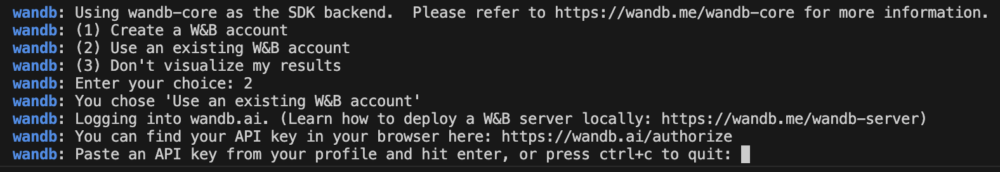

# MLOPS Project

This repository contains a containerized machine learning pipeline. The project is designed to run a training script inside a Docker container, with the ability to track experiments using Weights and Biases (W&B).

## Prerequisites

Before running the project, make sure you have the following installed:

- [Docker Desktop](https://www.docker.com/products/docker-desktop) application
- A terminal/command-line interface

## Steps to Run Locally

### 1. Clone the Repository

First, clone the repository to your local machine:

```bash
git clone https://github.com/sofiahorlacher/MLOPS.git
```

Swith into the project directory:
```bash
cd MLOPS
```

### 2. Build the Docker Image
Create a new Docker context:
```bash
docker context create mlops
docker context use mlops
```
If needed, you can overwrite Docker settings with the --docker argument. 

Then, build the Docker image using the following command:
```bash
docker --context mlops build -t main .
```

### 3. Run the Docker Container
Once the image is built, you can run the training script inside the container with this command:
```bash
docker --context mlops run -it main
```
You will be prompted in the terminal to choose how you want to log in to Weights and Biases (W&B). Choose the option that fits you best and follow the steps provided in the console. Should be looking like this:



## Troubleshooting
If you encounter any issues:
- Make sure Docker Desktop is running.
- Verify that you are using the correct context by running docker context ls and checking that the context is set to mlops.
- If you have trouble with Docker permissions, try restarting Docker or your terminal.
